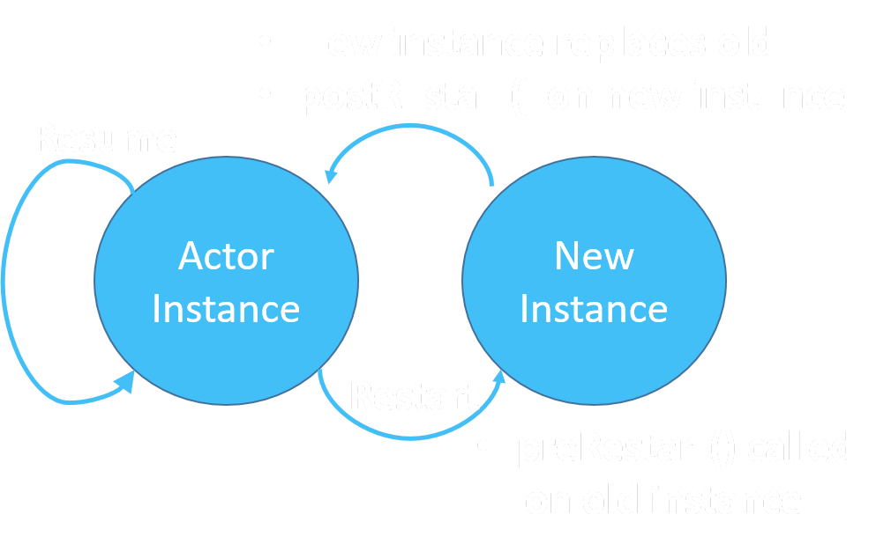
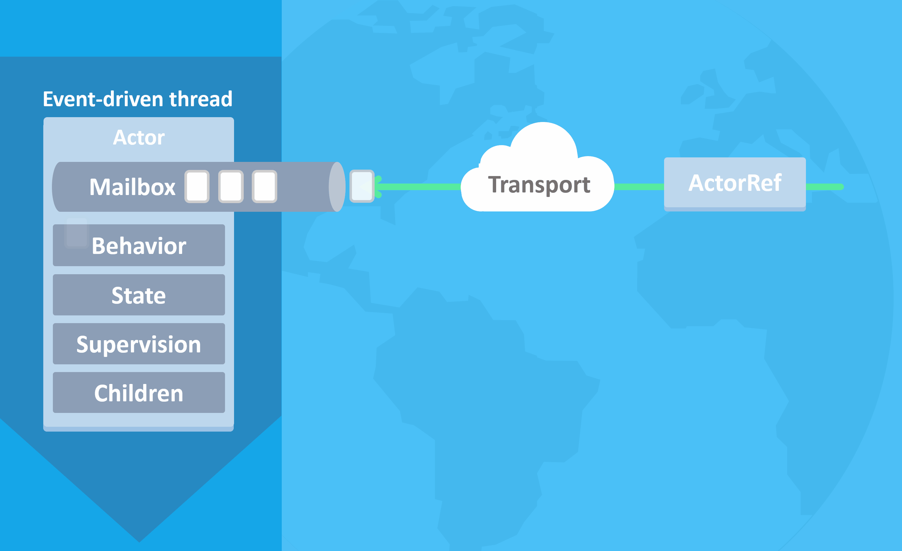
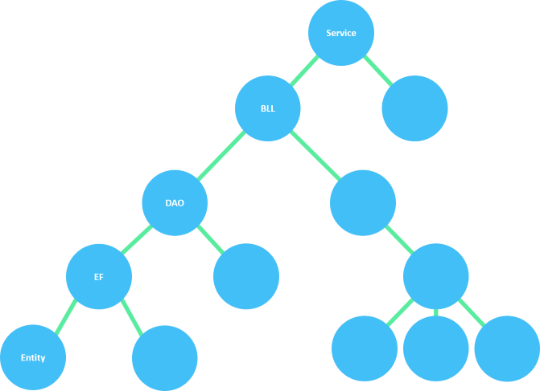
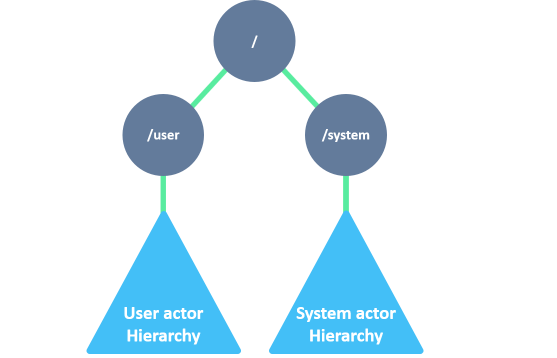
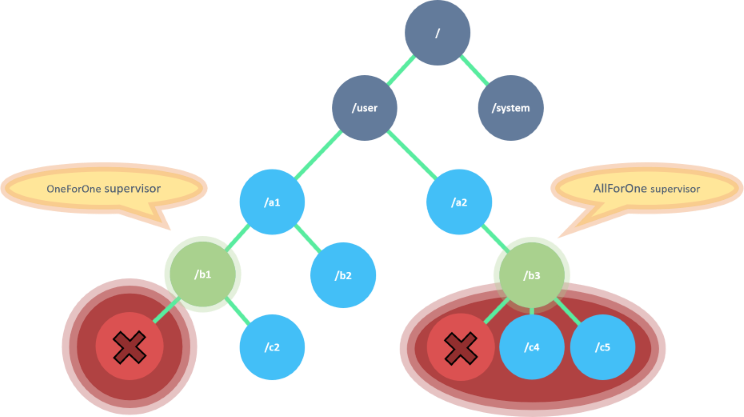
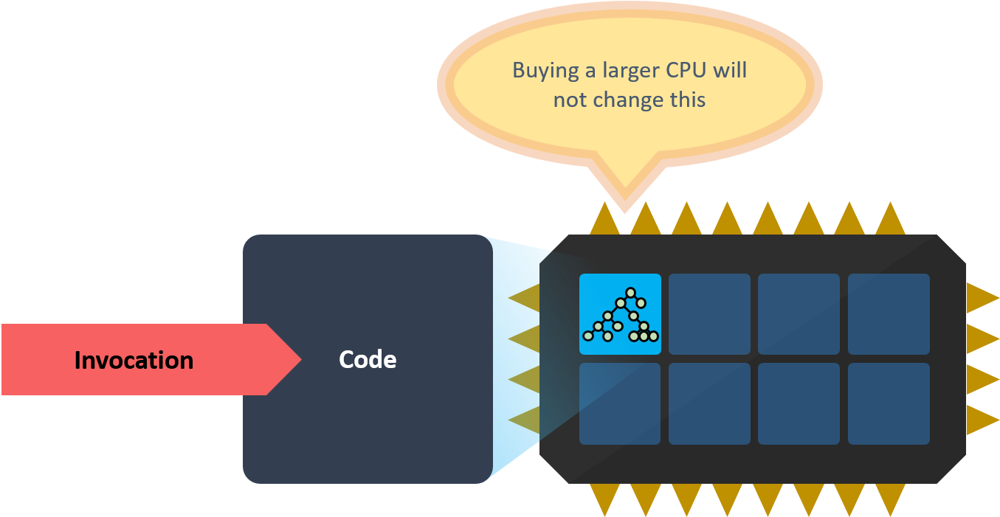
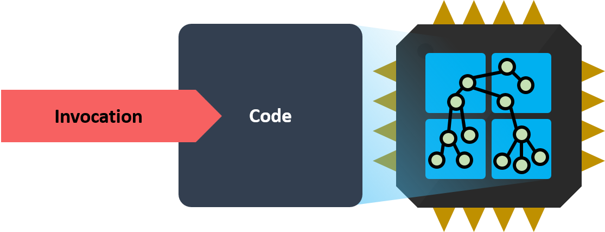
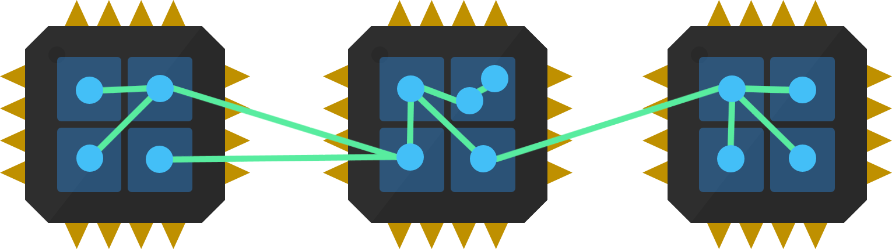

<!-- _footer: "" -->

# AKKA.NET

# AN INTRODUCTION

:link: [AkkaIntro.SeanKilleen.com](https://akkaintro.seankilleen.com)

---

# What We'll Cover

- Why this Matters
- Reactive Manifesto
- History / overview
- Concepts &amp; Benefits
- Demos

---
<!-- _footer: "" -->

#### <!--fit--> AKKA-KNOWLEDGEMENTS

## <!--fit-->Roger Johansson

- :bird: [@rogeralsing](http://twitter.com/rogeralsing)
- :envelope: [roger@nethouse.se](mailto:roger@nethouse.se)
- :earth_americas: [rogeralsing.com](https://rogeralsing.com)

---

---
<!-- _footer: "" -->

#### <!--fit--> AKKA-KNOWLEDGEMENTS

## <!--fit-->Petabridge

- :bird: [@petabridge](http://twitter.com/petabridge)
- :bird: [@aaronontheweb](http://twitter.com/aaronontheweb)
- :earth_americas: [Petabridge.com](https://rPetabridge.com)

---

<!-- _footer: "" -->

---

<!-- _footer: "" -->

# <!--fit--> Hi! :wave: I'm Sean.

- :bird: [sjkilleen](https://twitter.com/sjkilleen)
- :earth_americas: [SeanKilleen.com](https://seankilleen.com)
- :briefcase: [Excella](https://excella.com)

---

# WHY THIS MATTERS

<!-- Previously: Old school request/response. 

Not good enough now -->

---

## Reactive Manifesto

<http://www.reactivemanifesto.org>

We need to evolve with our users' expectations.

---

## Reactive Systems Are:

- Responsive
- Resilient
- Elastic
- Message-Driven

---

## As a Result, They Are:

- Flexible
- Loosely-coupled
- Scalable
- Easier to Change
- Fault tolerant
- Fast

---

# OVERVIEW

---

#### OVERVIEW

## Actors: Not New

<!-- Carl Hewitt -- 1973 white paper -->

---

#### OVERVIEW

## Where are the actors?

<!--                 
Erlang 
Scala (Box)
LinkedIn (Java Akka)
Orleans (Xbox – Halo)
WhatsApp
Telecom etc.							
Finance | Data crunching | Event Streams
Neural networks
-->

---

#### OVERVIEW

## Akka and Akka.NET

<!-- Port of Java Akka -->

---

# CONCEPTS

---

#### CONCEPTS

## Everything is an Actor

<!--
OOP Everything is an object; AM everything is an actor

Container for State, Behavior, Mailbox, Children, Supervision
-->

---

#### CONCEPTS

## Encapsulation

<!-- 
ActorRef encapsulates Behavior / responsibility

Functions as one unit
-->

---

#### CONCEPTS

## Immutable Messages

---

#### CONCEPTS

## Actors by Reference

---

#### CONCEPTS

## Props

---

## Every Actor Has:

- Address
- Context
- Supervision
- Mailbox
- Lifecycle

---

#### ADDRESSING

## Protocol

#### <!--fit--> <mark>akka.tcp://</mark>MySystem@localhost:8080/user/HelloWorldActor

---

#### ADDRESSING

## System

#### <!--fit--> akka.tcp://<mark>MySystem</mark>@localhost:8080/user/HelloWorldActor

---

#### ADDRESSING

## Address

#### <!--fit--> akka.tcp://MySystem<mark>@localhost:8080</mark>/user/HelloWorldActor

---

#### ADDRESSING

## Path

#### <!--fit--> akka.tcp://MySystem@localhost:8080<mark>/user/HelloWorldActor</mark>

---

---

# CONTEXT

<!-- 
Context.ActorOf is used to create children

Pretty subtle in that it's not always available

However, should know that every actor has one
-->

---
<!-- _footer: "" -->

<!-- 
Event-driven thread; no polling

Behavior, State, Supervision

One Message at a time from Mailbox

Transport agnostic
-->

---

#### FAULTS

## Classic .NET System

<!--
Think of a classic OOP System

Exceptions may or may not bubble up

Unclear who is responsible for handling errors
-->

---

#### FAULTS

## Error Kernel

<!--
System and User actors

Parent is responsible for children

Thinking about it up front at dev time
-->

---

#### FAULTS

## Strategies

<!--
One for one vs. All for One

Easy custom supervisory structures 
-->

---

# BENEFITS

---

#### BENEFITS

# Async by Default

<!--
Who here writes great async code always? Your async code is probably terrible

Async without the cruft

Easier to reason about
-->

---

#### BENEFITS

# Recoverability

<!--
Child actors vs character actors

Scale out work across many actors

Push dangerous work into child actors
-->

---

#### BENEFITS

# Cheap!

<!--
No CPU unless a message is actually processing

~2.5 million actors per GB

50 million messages / sec on single machine
-->

---

#### BENEFITS

# Location Transparency

<!--
Think Cell phone grid 

You don't need to care where the actor lives

Can be changed via configuration without code updates

Same / different process, same / different machine
-->

---

#### BENEFITS

# Easy State Machines

<!--
Become / Unbecome

Can change how it will process next message

-->

---

#### BENEFITS

# Configurability

<!--
HOCON: Human-Optimized Config Object Notation

Fallback and layered configs

-->

---

<!--Single Core at first -->

---

<!-- 
Maybe then multi-core

Maybe then you'd adapt to use TPL or async / await

What happens when it's not enough?
-->
---

<!--
This is a key concept.

It's just code you write now

Adding more cores and more machines is the same

Reduce cost of change
-->

---

## Scaling Up &amp; Out:

# The :clap: Same :clap: Thing

---

# DEMOS!

---

## :notes: We've Only Just Begun :notes:

- Persistence
- Clustering
- Streaming

<!--
Persistence: Journal of events using a base class (and snapshots!)

Clustering: Add / remove notes without adjusting. Peer to peer, gossip/consensus, trivial scale-out

Also poison pills: ordinary message that stops an actor

Also dead letters: When an actor terminates, sends messages here for recovery

Also service bus interoperability

Also .NET Core
-->

---

## Want More?

- [GetAkka.net](http://GetAkka.net)
- [Petabridge.com](http://Petabridge.com) and [Nethouse.se](http://nethouse.se)
- [GitHub: AkkaDotNet](http://github.com/Akkadotnet)

<!-- OSS is awesome -- get involved!-->

---

<!-- _footer: "" -->

# <!--fit--> Thanks!

- :bird: [sjkilleen](https://twitter.com/sjkilleen)
- :earth_americas: [SeanKilleen.com](https://seankilleen.com)
- :briefcase: [Excella](https://excella.com)
