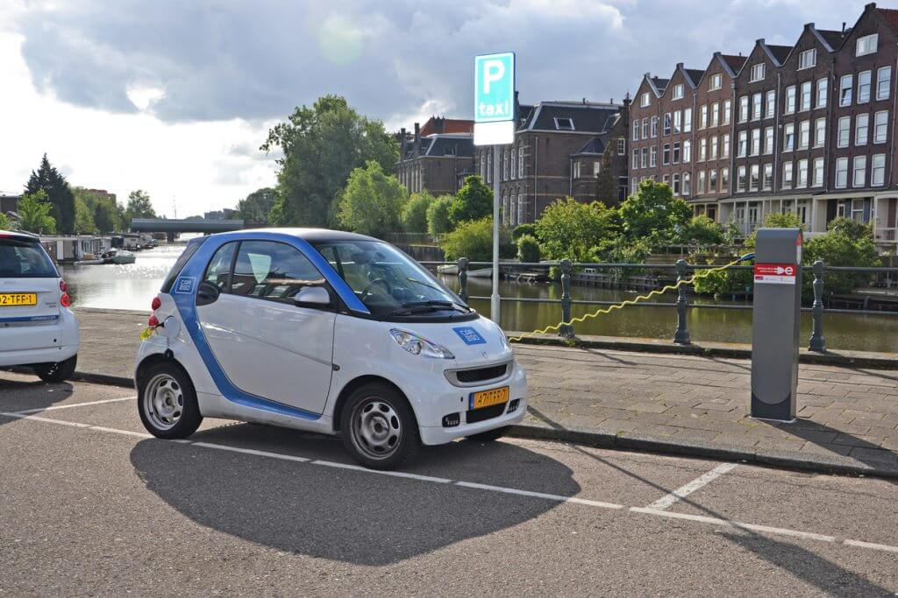
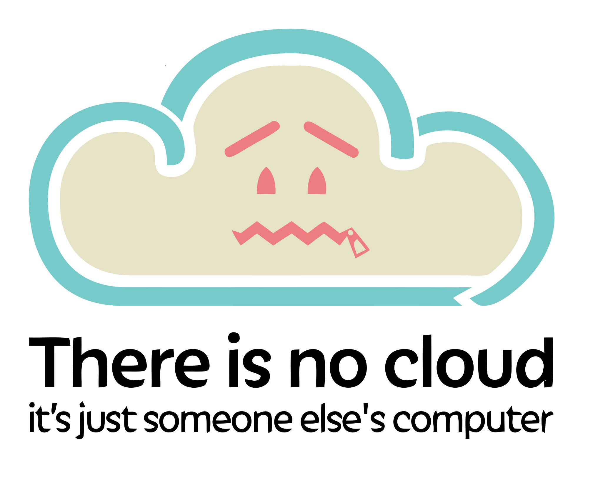
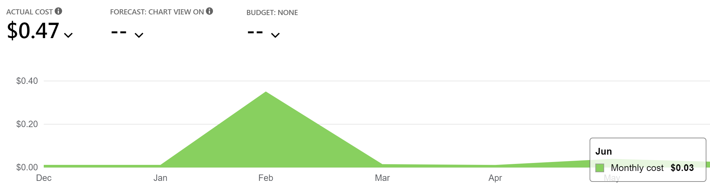

# (SERVER)LESS

# IS MORE

#### An Introduction to Azure Functions

<https://serverlessismore.seankilleen.com/>

---

---

<!-- _footer: "" -->

---

<!-- _footer: "" -->

# <!--fit--> Hi! :wave: I'm Sean.

- :bird: [sjkilleen](https://twitter.com/sjkilleen)
- :earth_americas: [SeanKilleen.com](https://seankilleen.com)
- :briefcase: [Excella](https://excella.com)

---

## LET'S DO THIS.

- What is serverless?
- Pros / Cons
- Demo: Azure Functions &amp; Key Vault

---

# WHAT IS SERVERLESS?

---

#### WHAT IS SERVERLESS?

# The Car Analogy

(Thanks to [Dana Engebretson](https://twitter.com/bigdana) and [Pat Leong](https://www.excella.com/insights/in-the-drivers-seat-with-serverless-functions))

---

<!-- _footer: "" -->

<!-- 
 - Like owning a server
 - Maintenance cost entirely on you
-->
---

<!-- _footer: "" -->

<!--
Leasing

 - Like VPS / VPC
 - Still need to maintain
-->

---

<!-- _footer: "" -->

<!-- 
Renting 

 - Like Platform-as-a-Service
 - You pay to rent the tooling
 - Pay in larger chunks
-->

---
<!-- _footer: "" -->

<!-- 
Car Sharing

 - Like serverless
 - Pay only for what you need / use
-->
---

# PROS

---

#### PROS

# Cost-Effective

---

#### PROS

# Less Plumbing; More Value

---

#### PROS

# Easy Integration

---

# CONS

---
<!-- _footer: "" -->

---

#### CONS

# Cold Starts

---

#### CONS

# Vendor Lock-in

---

#### CONS

# Less Control

---

#### CONS

# Cognitive Overhead

---

#### CONS

# Long-Running Tasks

<!--
- Serverless is generally meant for short, contained bits of work. Long-running tasks may be very expensive.

-->

---
<!-- _footer: "" -->

<!-- 
I'm new at this -- will do my best to answer questions

I do have a a working version -- if need be, we'll dump to that

This is to see how far we'll get
-->

---

# <!--fit--> :money_with_wings: But at what cost?! :money_with_wings:

---

---

## ...AND There's MORE!

- Injection
- Durable functions
- Enterprise plans
- API Gateways

---

<!-- _footer: "" -->

# <!--fit--> Thanks!

- :bird: [sjkilleen](https://twitter.com/sjkilleen)
- :earth_americas: [SeanKilleen.com](https://seankilleen.com)
- :briefcase: [Excella](https://excella.com)
