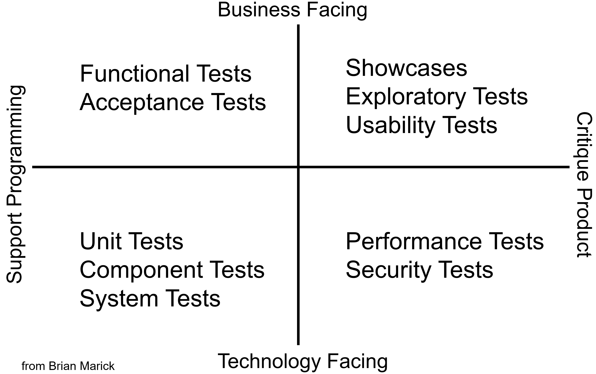
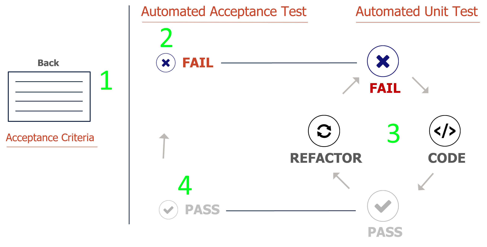

## The Joy

## of Functional Testing

An Introduction with SpecFlow

[https://JoyOfFunctionalTesting.seankilleen.com/](https://JoyOfFunctionalTesting.seankilleen.com/)

---

<!-- TODO: Change -->


---


---

<!-- <Split>


<h3 class="less-bottom-margin"> Hi! I'm Sean.</h3>
<ul class="fa-ul">
    <li class="fa-li"><FontAwesomeIcon size="xs" icon ={faTwitter} listItem /> @sjkilleen</li>
    <li class="fa-li"><FontAwesomeIcon size="xs" icon ={faGithub} listItem />SeanKilleen</li>
    <li class="fa-li"><FontAwesomeIcon size="xs" icon ={faGlobe} listItem />SeanKilleen.com</li>
    <li class="fa-li"><FontAwesomeIcon size="xs" icon ={faBriefcase} listItem />CapTechConsulting.com</li>
</ul>

</Split>

--- -->

## Let's Do this

* Why this matters
* Specification by example
* Functional / Acceptance Testing
* Gherkin syntax
* Benefits
* SpecFlow demos

---

# Why this matters

---


---

#### Why this matters

# Confusion

---

#### Why this matters

# Trust

---

#### Why this matters

# Feature Fighting

---


---


---


---

## Functional &amp;

## Acceptance Tests

---



---


---


---


---


---


---

# Gherkin Syntax

---

#### Gherkin Syntax

* Given
* When
* Then

---

#### Gherkin Syntax

Old and busted:

```
A system shall allow login access 
```

---

#### Gherkin Syntax

New hotness:

```
Given I am on the home page
  And I have clicked the login button
When I enter a valid username
  And I enter a valid password
  And I login
Then I should be redirected to my profile page
```

---


---

# Benefits

---


---



---

#### Benefits

# Consensus

---

#### Benefits

# Shift to the Left

---

#### Benefits

# Sign-Off

---

#### Benefits

# Missed Requirements

---

# SpecFlow

---


---


<!-- <Split>


<h3 class="less-bottom-margin">Thanks!</h3>
<ul class="fa-ul">
    <li class="fa-li"><FontAwesomeIcon size="xs" icon ={faTwitter} listItem /> @sjkilleen</li>
    <li class="fa-li"><FontAwesomeIcon size="xs" icon ={faGithub} listItem />SeanKilleen</li>
    <li class="fa-li"><FontAwesomeIcon size="xs" icon ={faGlobe} listItem />SeanKilleen.com</li>
    <li class="fa-li"><FontAwesomeIcon size="xs" icon ={faBriefcase} listItem />CapTechConsulting.com</li>
</ul>

</Split> -->
