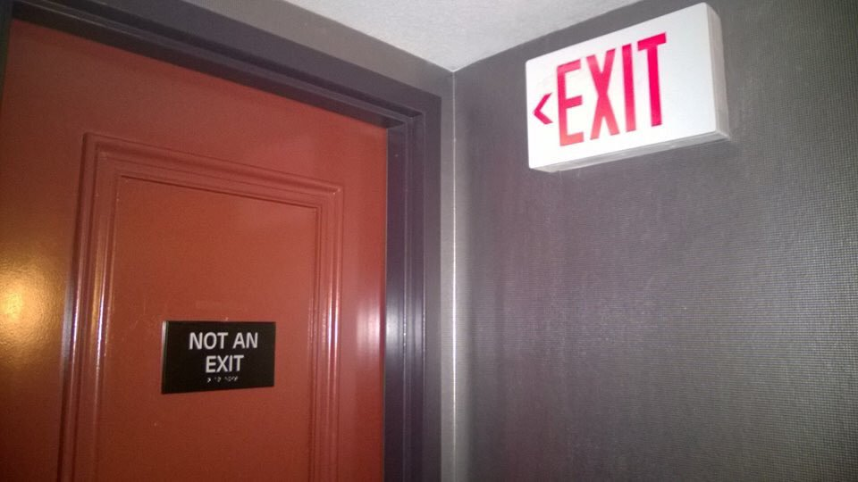

# The Joy

# of Functional Testing

An Introduction with SpecFlow

[JoyOfFunctionalTesting.seankilleen.com](https://JoyOfFunctionalTesting.seankilleen.com/)

---


---

<!-- _footer: "" -->


---

<!-- _footer: "" -->


# <!--fit--> Hi! :wave: I'm Sean.

- :bird: [sjkileen](https://twitter.com/sjkilleen)
- :earth_americas: [SeanKilleen.com](https://seankilleen.com)
- :briefcase: [Excella](https://excella.com)

---

## Let's Do this

* Why this matters
* Specification by example
* Functional / Acceptance Testing
* Gherkin syntax
* Benefits
* SpecFlow demos

---

# Why this matters

---

<!-- _footer: "" -->


---

#### Why this matters

# Confusion

---

#### Why this matters

# Trust

---

#### Why this matters

# Feature Fighting

---

<!-- _footer: "" -->


---

<!-- _footer: "" -->


---

<!-- _footer: "" -->


---

## Functional &amp;

## Acceptance Tests

---
<!-- _footer: "" -->


---
<!-- _footer: "" -->


---
<!-- _footer: "" -->


---
<!-- _footer: "" -->


---

<!-- _footer: "" -->


---
<!-- _footer: "" -->



---

# Gherkin Syntax

---

#### Gherkin Syntax

* Given
* When
* Then

---

#### Gherkin Syntax

Old and busted:

```
A system shall allow login access 
```

---

#### Gherkin Syntax

New hotness:

```
Given I am on the home page
  And I have clicked the login button
When I enter a valid username
  And I enter a valid password
  And I login
Then I should be redirected to my profile page
```

---
<!-- _footer: "" -->


---

# Benefits

---


---


---

#### Benefits

# Consensus

---

#### Benefits

# Shift to the Left

---

#### Benefits

# Sign-Off

---

#### Benefits

# Missed Requirements

---

# SpecFlow

---


---
<!-- _footer: "" -->


---
<!-- _footer: "" -->


# Thanks!

- :bird: [sjkileen](https://twitter.com/sjkilleen)
- :earth_americas: [SeanKilleen.com](https://seankilleen.com)
- :briefcase: [Excella](https://excella.com)
